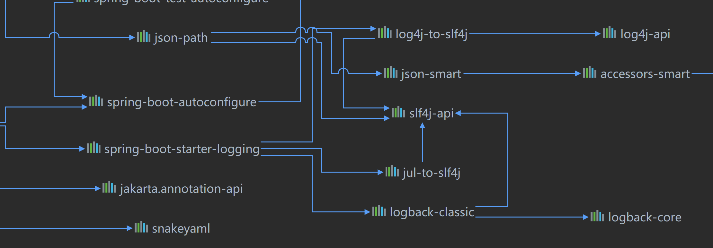

# Java日志框架


## 日志发展史

### 第一阶段 混乱时期 System.out

2001年以前，Java是没有日志库的，打印日志全凭System.out和System.err

缺点:

1.   产生大量的IO操作同时在生产环境中无法合理的控制是否需要输出
2.   输出的内容不能保存到文件
3.   只打印在控制台，打印完就过去了，也就是说除非你一直盯着程序跑
4.   无法定制化，且日志粒度不够细
     

### 第二阶段 日志起源 Log4j

2001年，**ceki Gulcü**开发了日志框架log4j

Log4j拥有比较完善日志功能

 后来，log4j成为Apache项目，Ceki加入Apache组织，Apache还曾经建议Sun引入Log4j到Java的标准库中，但Sun拒绝了。


### 第三阶段 百花齐放 JUL

2002年2月，JDK1.4发布，SUN推出了自己的日志标准库JUL（Java Util Logging），同时市场上有多种日志框架可供选择，同一个项目中可能使用好几种，比较混乱


### 第四阶段 日志门面 JCL

2002年8月，Apache下属jakatra部门开发出了JCL（Jakarta Commons Logging）又称Apache Commons Logging，JCL不实现日志功能，仅用来整合日志，类似与JDBC，是日志抽象层。

JCL提供日志接口，在项目中自动寻找日志框架来实现自己地接口。

在使用JCL后代码中的日志可以很轻易地在Log4j和JUL之间切换。

但是，JCL不好用（没经历过那个时代，不知道为啥不好用）


### 第五阶段 统一 SLF4J

2005年，ceki Gulcü离开apatch，开发出slf4j（Simple Logging Facade for Java）。

slf4j也是一个日志门面，但是只有接口没有实现。

于是slf4j使用桥接包来使Log4j和JUL实现slf4j的接口。

又使用适配器来桥接JCL门面，使日志得到统一。


### 第六阶段 高性能

2006年，ceki Gulcü开发出logback

2012年，apatch开发出log4j2


## 日志选择

日志的种类分为日志实现和日志门面，通常要选择一个日志门面和一个日志实现

|         日志实现          | 日志门面  |
| :-----------------------: | :-------: |
| Log4j（低性能、**淘汰**） |    JCL    |
| JUL（Java官方、小项目用） | ==SJF4J== |
|    ==Log4j2==(apatch)     |           |
|  ==Logback==(ceki Gulcü)  |           |

SpringBoot官方的选择是`SJF4J+Logback`


## 日志使用


### 在SpringBoot下使用日志SLF4J + Logback

SpringBoot启动器中依赖了slf4j和logback以及用来转换Spring框架中日志的桥接器



因此不需要额外引用jar包。


在要使用日志的类上添加静态属性即可其中xxx是当前类的类名

```java
private static final Logger log = LoggerFactory.getLogger(xxx.class);
```

一种简便的方法是使用lombak的注解`@Slf4j`，相当于上面那句。事实上，上面那句就是通过添加注解在编译后查看class文件复制的 : )


在application.yml文件中可以配置Logback。Logback配置详解：[Logback](Logback)


